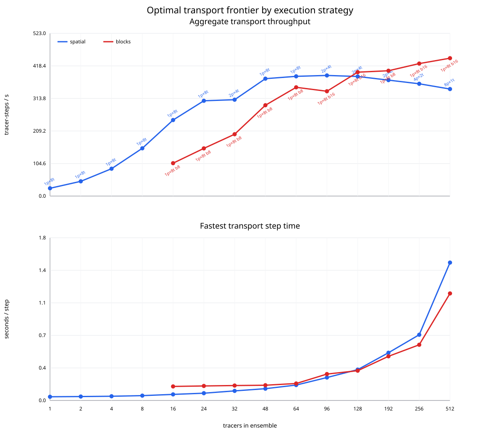

# Performance and threading

Wombat's main performance opportunity is batching many passive tracers through
the same meteorology. Throughput is reported as:

```text
tracer-steps/s = transport steps * tracer count / wall time
```

This measures completed tracer work per second. For a fixed simulation length
and thousands of independent tracers, maximizing aggregate tracer-steps/s
minimizes wall time, subject to memory capacity and node allocation.

## Thread controls

Numba acceleration is enabled by default when installed. The main controls are:

| Variable | Purpose |
|---|---|
| `WOMBAT_NUMBA` | Enable or disable every optional Numba path; defaults to enabled |
| `WOMBAT_NUMBA_THREADS` | Process-wide Numba thread count; defaults to 1 |

There are no subsystem-specific overrides. Wombat applies
`WOMBAT_NUMBA_THREADS` once per process, so transport, HISTORY accumulation,
and any other parallel Numba kernels share the same worker count. Serial Numba
kernels, including ObsOperator sampling, still follow `WOMBAT_NUMBA` but do not
use the extra workers.

Numba's own `NUMBA_NUM_THREADS` is an upper bound established when Numba
starts. On a cluster, set it to at least the largest Wombat thread count:

```bash
export NUMBA_NUM_THREADS=8
export WOMBAT_NUMBA_THREADS=8
export OMP_NUM_THREADS=1
```

Falsy switch values are `0`, `false`, `no`, `off`, and `none`. If Numba is
unavailable or disabled, Wombat emits a major performance warning.

## Tracer blocks and execution strategy

Tracer state is always stored as contiguous blocks with internal layout
`(block, level, latitude, longitude, lane)`. The last block is padded when the
tracer count is not a multiple of its width. This representation is transparent
to restart, HISTORY, emissions, and ObsOperator code: tracer names and outputs
retain their ordinary canonical ordering.

Storage layout and parallel execution are separate choices. These environment
variables select the execution policy and storage width:

| Variable | Purpose |
|---|---|
| `WOMBAT_TRANSPORT_EXECUTOR` | `spatial` (default) or `blocks` |
| `WOMBAT_TRANSPORT_BLOCK_WIDTH` | Positive tracer lanes per block; strategy-dependent default |

The strategies differ only in where Numba places parallel work:

- `spatial` visits tracer blocks sequentially and uses threads over the spatial
  task space inside each transport operator. With no explicit block width, all
  tracers occupy one block.
- `blocks` uses one top-level parallel loop over tracer blocks. Each worker runs
  the complete `TPCORE -> VDIFF -> convection` chain for its block using serial
  inner kernels. Its default block width is 8.

The `blocks` executor requires Numba. It uses Numba's worker pool directly; it
does not create Python threads or a Python scheduling layer. With one Numba
thread it offers no parallelism advantage over spatial execution.

Spatial execution is the natural choice for small tracer counts or when there
are too few blocks to occupy the configured workers. Block execution is
intended for larger tracer ensembles where independent blocks provide enough
outer parallel work:

```bash
export NUMBA_NUM_THREADS=8
export WOMBAT_NUMBA_THREADS=8
export WOMBAT_TRANSPORT_EXECUTOR=blocks

.venv/bin/python -m wombat_transport.run path/to/run.yml
```

Block width controls the tradeoff between the number and size of independent
tasks. Narrower blocks expose more parallel tasks; wider blocks retain more
tracer amortization within each operator. Width 8 remains a safe default;
widths 12 and 16 are also useful candidates for eight-thread processes:

```bash
WOMBAT_TRANSPORT_EXECUTOR=blocks \
WOMBAT_TRANSPORT_BLOCK_WIDTH=16 \
WOMBAT_NUMBA_THREADS=8 \
  .venv/bin/python -m wombat_transport.run path/to/run.yml
```

An explicit block width is also legal with spatial execution. In that case the
spatial executor processes each configured block in sequence while retaining
within-operator threading:

```bash
WOMBAT_TRANSPORT_EXECUTOR=spatial \
WOMBAT_TRANSPORT_BLOCK_WIDTH=16 \
  .venv/bin/python -m wombat_transport.run path/to/run.yml
```

This can be useful for controlled comparisons, but it is not required to use
block-native tracer storage: storage is blocked in every execution mode.

### Choosing an executor and block width

Choose the execution policy per process, after deciding how tracers and CPUs
will be divided between processes. For `N` tracers, block width `W`, and `T`
Numba threads, the outer executor has:

```text
B = ceil(N / W) blocks
```

Block execution is most likely to win when `B >= T` and the blocks divide
evenly between workers. A multiple of `T` is ideal. Mild imbalance can still
be efficient when there are several blocks per worker, but a small remainder
can be costly when it makes some workers process two blocks while others
process only one. The final block is padded to width `W`, so widths that avoid
large amounts of inactive-lane work are preferable.

Task balance is not the only consideration. Very narrow blocks lose
within-block efficiency even when perfectly balanced, while very wide blocks
increase the per-worker working set and may leave workers idle. On the tested
AVX2 machine, widths 8, 12, and 16 form the useful range: all are multiples of
the four-double SIMD width, while narrower widths 6--7 and wider widths 20--24
fall outside the best throughput envelope. Treat `{8, 12, 16}` as the initial
candidate set rather than assuming that powers of two are intrinsically
better.

For eight threads, representative balanced choices are:

| Tracers per process | Width | Blocks | Blocks per thread |
|---:|---:|---:|---:|
| 64 | 8 | 8 | 1 |
| 96 | 12 | 8 | 1 |
| 128 | 16 | 8 | 1 |
| 192 | 12 | 16 | 2 |
| 256 | 16 | 16 | 2 |
| 512 | 16 | 32 | 4 |

These examples explain useful candidates; they are not a hard-coded dispatch
table. If no candidate produces enough reasonably balanced blocks, spatial
execution is usually the better choice. Process sharding can change both `N`
and `T`, so the complete frontier may prefer a multi-process spatial layout or
a different block width from a single-process comparison.

Calibrate each supported grid separately. Block count depends only on tracer
layout, but the cost and working set of each block depend on the number of
horizontal cells. Spatial execution also draws its parallelism from the fixed
grid. Consequently, a result measured at 2x2.5 should not be assumed to select
the same width or process topology at 4x5, even though the block-count rule is
the same. Compiler version, SIMD width, cache hierarchy, and CPU topology can
also shift the final crossover.

## Calibrating a new machine

`tools/benchmark_transport_frontier.py` measures the synthetic full transport
chain across process, thread, executor, and block-width configurations. It is
transport-only: meteorology I/O, HISTORY, emissions, and ObsOperator are not
included. The synthetic forcing uses the selected run configuration only for
its supported grid definition.

Provide an ordered list of Linux CPU identifiers, the core budgets to test,
and total tracer counts:

```bash
.venv/bin/python tools/benchmark_transport_frontier.py run \
  --run-config validation_runs/cases/realistic_restart_noemis_2x25/wombat/main/run.yml \
  --cpus 0,2,4,6,8,10,12,14 \
  --core-counts 1 2 4 8 \
  --tracer-counts 16 32 64 96 128 192 256 512 \
  --binder auto \
  --block-widths 8 12 16 \
  --output-dir benchmark-results/transport-frontier
```

For each core budget `C`, the tool tests every balanced factorization
`processes * threads/process = C`. Total tracers are divided as evenly as
possible between processes. Multithreaded configurations compare full-width
spatial execution with useful requested block widths; one-thread processes use
the ordinary spatial path because block parallelism has no work to expose.

The CPU list defines nested scopes: a four-core case uses the first four
entries and an eight-core case uses the first eight. Select one logical CPU
from each physical core unless SMT is deliberate. The tool warns when the
chosen list contains detected SMT siblings.

Binding modes are `taskset`, `numactl`, `none`, or `auto`. `auto` prefers a
usable `numactl` installation and falls back to `taskset` when its binding
probe fails. The numactl backend binds each rank to its exact CPUs and supports
`bind`, `local`, and `interleave` memory policies. On a multi-socket system,
benchmark one NUMA node or socket at a time unless cross-node placement is the
intended workload.

Workers compile and warm up after binding, then start each measured iteration
at a shared monotonic-clock target. Effective step time ends when the slowest
rank finishes. The two headline metrics are:

```text
seconds/step = effective step time
aggregate tracer-steps/s = total tracers / effective step time
```

At a fixed tracer count, these metrics always select the same configuration:
the tracer count is a constant, so maximizing `tracers / seconds` is identical
to minimizing `seconds`. They are both retained because they answer different
operational questions. Seconds per step predicts turnaround time, while
tracer-steps per second measures how effectively a machine processes a large
ensemble.

The output directory contains:

- `manifest.json`: command, Git state, system, CPU, NUMA, and sweep metadata;
- `iterations.csv`: raw synchronized rank and makespan measurements;
- `summary.csv`: every configuration, per-core-budget winners, and the overall
  and per-executor winners for each tracer count;
- `winners.md`: a compact deployment table;
- `transport_frontier.svg`: aligned throughput and seconds-per-step panels for
  the fastest spatial and blocked configurations at each tracer count,
  annotated with their topologies;
- `cases/`: resumable per-configuration inputs, results, and worker logs.

Use `--dry-run` to inspect the generated matrix, `--resume` to continue an
interrupted output directory, and rebuild reports without rerunning with:

```bash
.venv/bin/python tools/benchmark_transport_frontier.py report \
  benchmark-results/transport-frontier
```

### Reading the frontier

The report first selects the fastest configuration separately for spatial and
blocked execution at every tested tracer count. It is allowed to choose a
different core budget, process count, thread count, or block width at each
point. The annotations have forms such as `1p×8t` for one process with eight
threads and `2p×4t b16` for two four-thread processes using blocked execution
with width 16.

The upper panel answers: "How much aggregate tracer work can one machine
complete?" The lower panel answers: "How long does one transport step take?"
Their x axes and points are aligned, and both panels use the same winning
configuration for a given strategy and tracer count.



This example used the 2x2.5 synthetic transport chain, one hardware thread on
each of eight Intel Core i7-14700KF P-cores, no SMT, two warmups, and five
measured iterations per configuration. It swept every balanced process/thread
factorization and block widths 8, 16, and 32. It is an example of the decision
process, not a portable recommendation for other machines.

The spatial frontier reaches about 347 tracer-steps/s at 96 tracers and then
falls to 311 at 512. The blocked frontier overtakes it around 128 tracers and
continues to 423 tracer-steps/s at 512. This is consistent with blocked
execution improving locality while a larger ensemble amortizes fixed setup
work. It does not, by itself, prove perfect scaling with core count; that claim
would require comparing speedup as cores are added.

### Choosing a deployment

If one machine must transport a fixed number of tracers, find that tracer
count on the x axis and use the lowest point in the seconds-per-step panel.
The annotation supplies the execution strategy and topology. For example,
`2p×4t b16` means dividing the ensemble evenly between two independently
bound Wombat processes, giving each four CPUs, and setting:

```bash
WOMBAT_NUMBA_THREADS=4 \
WOMBAT_TRANSPORT_EXECUTOR=blocks \
WOMBAT_TRANSPORT_BLOCK_WIDTH=16 \
  .venv/bin/python -m wombat_transport.run path/to/shard.yml
```

The frontier benchmark coordinates its worker processes internally, but a
production multi-process run remains an ensemble of separate Wombat jobs.
Launch and bind those jobs with the site scheduler or workflow manager, split
the tracers as evenly as possible, and give each job the indicated thread
count. A one-process winner can be used directly without ensemble sharding.

If the tracer load per machine is flexible, use both panels to choose a knee.
Moving right generally improves per-machine throughput because fixed work is
amortized over more tracers, but it also increases the wall time of every
step. In the example, 64 tracers deliver 328 tracer-steps/s at 0.195
seconds/step: about 78% of the measured 512-tracer throughput with only 16% of
its step latency. At 128 tracers the corresponding figures are 360
tracer-steps/s and 0.355 seconds/step. Either may be a better operating point
than the maximum-throughput 512-tracer load when turnaround time matters.

For a fixed total tracer ensemble distributed across several identical
machines, divide the total by each candidate number of machines and consult
the point nearest that per-machine shard size. With `M` equal shards, fleet
throughput is approximately `M` times the plotted per-machine throughput,
while synchronized step latency is approximately the plotted seconds per
step. More, smaller shards reduce wall time but usually use each machine less
efficiently; fewer, larger shards improve per-machine throughput but take
longer per step. Benchmark the exact shard sizes when this tradeoff affects a
large production allocation.

The calibration is transport-only. Meteorology reading, emissions, HISTORY,
and ObsOperator work can shift the best end-to-end operating point, especially
for small tracer counts. Use the synthetic frontier to choose a short list of
topologies, then confirm the selected deployment with a representative full
run before committing a large allocation.

### GEOS-Chem comparison frontier

`tools/benchmark_gc_transport_frontier.py` applies the same CPU scopes,
balanced process sharding, synchronized repetitions, and headline metrics to
the GEOS-Chem operator harness. GEOS-Chem has no Wombat block executor, so its
matrix sweeps only `processes * OpenMP threads/process = cores`:

```bash
tools/gc_harness/build_gc_transport_frontier_harness.sh

.venv/bin/python tools/benchmark_gc_transport_frontier.py run \
  --run-config validation_runs/cases/realistic_restart_noemis_2x25/wombat/main/run.yml \
  --executable tools/gc_harness/build/gc_transport_frontier_harness \
  --fixture-dir oracle_data/base_initial_transport_chain_v3 \
  --cpus 0,2,4,6,8,10,12,14 \
  --core-counts 1 2 4 8 \
  --tracer-counts 16 32 64 96 128 192 256 512 \
  --output-dir benchmark-results/gc-transport-frontier
```

The GC worker loads the existing full-chain harness inputs once and keeps the
operator state resident. Intermediate NetCDF I/O, executable startup, and
initialization are excluded from measured transport steps. Its CSV, manifest,
winners table, and SVG use the Wombat frontier schema for direct metric and
topology comparisons.
The fixture grid must match the selected run configuration; calibrate 2x2.5
and 4x5 with separately generated full-chain inputs.

## Local end-to-end comparison

The one- to four-thread GEOS-Chem timings were measured on 16 July 2026; the
eight-thread GEOS-Chem timings and all Wombat timings were refreshed on 17
July 2026, on the same Intel Core i7-14700KF. The one-tracer cases cover two
days; the 24- and 100-tracer cases cover one day.
The 100-tracer workload adds 76 synthetic background-only CO2 tracers to the
residual case. Each Wombat row reports the faster applicable transport
executor and its storage width. Direct transport sweeps narrowed the candidate
widths before end-to-end timing. Spatial execution won through 24 tracers and
at one or two threads; block execution won the 100-tracer rows with width 25
at four threads and width 16 at eight threads.

Both engines read MERRA-2 meteorology, run ObsOperator, and write configured
output. Multi-tracer cases also read and apply residual emissions. Runs were
sequential and unpinned, so this is a practical snapshot rather than a
controlled microbenchmark.

| Grid | Tracers | Threads | Executor | Width | GEOS-Chem wall s | Wombat wall s | GEOS-Chem tracer-steps/s | Wombat tracer-steps/s | Wombat speedup |
|---|---:|---:|---|---:|---:|---:|---:|---:|---:|
| 2x2.5 | 1 | 1 | spatial | 1 | 66.10 | 36.99 | 4.4 | 7.8 | 1.79x |
| 2x2.5 | 1 | 2 | spatial | 1 | 49.25 | 27.34 | 5.8 | 10.5 | 1.80x |
| 2x2.5 | 1 | 4 | spatial | 1 | 39.06 | 21.58 | 7.4 | 13.3 | 1.81x |
| 2x2.5 | 1 | 8 | spatial | 1 | 34.44 | 19.34 | 8.4 | 14.9 | 1.78x |
| 2x2.5 | 24 | 1 | spatial | 24 | 200.46 | 50.79 | 17.2 | 68.0 | 3.95x |
| 2x2.5 | 24 | 2 | spatial | 24 | 124.01 | 35.67 | 27.9 | 96.9 | 3.48x |
| 2x2.5 | 24 | 4 | spatial | 24 | 83.28 | 26.21 | 41.5 | 131.9 | 3.18x |
| 2x2.5 | 24 | 8 | spatial | 24 | 65.83 | 21.75 | 52.5 | 158.9 | 3.03x |
| 2x2.5 | 100 | 1 | spatial | 100 | 710.41 | 158.14 | 20.3 | 91.1 | 4.49x |
| 2x2.5 | 100 | 2 | spatial | 100 | 436.12 | 110.08 | 33.0 | 130.8 | 3.96x |
| 2x2.5 | 100 | 4 | blocks | 25 | 286.84 | 76.69 | 50.2 | 187.8 | 3.74x |
| 2x2.5 | 100 | 8 | blocks | 16 | 219.09 | 62.94 | 65.7 | 228.8 | 3.48x |
| 4x5 | 1 | 1 | spatial | 1 | 16.51 | 9.93 | 17.4 | 29.0 | 1.66x |
| 4x5 | 1 | 2 | spatial | 1 | 13.61 | 7.85 | 21.2 | 36.7 | 1.73x |
| 4x5 | 1 | 4 | spatial | 1 | 11.49 | 6.85 | 25.1 | 42.0 | 1.68x |
| 4x5 | 1 | 8 | spatial | 1 | 10.63 | 6.77 | 27.1 | 42.6 | 1.57x |
| 4x5 | 24 | 1 | spatial | 24 | 49.38 | 12.91 | 70.0 | 267.8 | 3.83x |
| 4x5 | 24 | 2 | spatial | 24 | 30.46 | 9.85 | 113.4 | 350.7 | 3.09x |
| 4x5 | 24 | 4 | spatial | 24 | 20.30 | 7.71 | 170.3 | 448.3 | 2.63x |
| 4x5 | 24 | 8 | spatial | 24 | 15.80 | 6.76 | 218.7 | 511.2 | 2.34x |
| 4x5 | 100 | 1 | spatial | 100 | 176.16 | 37.33 | 81.7 | 385.7 | 4.72x |
| 4x5 | 100 | 2 | spatial | 100 | 105.78 | 26.56 | 136.1 | 542.2 | 3.98x |
| 4x5 | 100 | 4 | blocks | 25 | 69.75 | 17.92 | 206.5 | 803.7 | 3.89x |
| 4x5 | 100 | 8 | blocks | 16 | 54.37 | 15.14 | 264.9 | 951.3 | 3.59x |

Wombat speedup is GEOS-Chem wall time divided by Wombat wall time. Fixed
startup, meteorology, ObsOperator, and output costs make scaling with tracer
count deliberately nonlinear.

`tools/benchmark_documented_runs.py` reruns only the Wombat side from existing
materialized validation directories, compares the applicable executors, and
prints the selected rows as Markdown. See its `--help` output for the required
materialized-data, Python, work, and result paths.

## High-tracer cluster result

A separate experiment on one 40-core CPU socket of the Hercules cluster at
MSU sustained approximately 700 tracer-steps/s with 400 tracers. That result
is not directly comparable to the local table, but it demonstrates that
single-node throughput can remain strong beyond the small validation cases.

For profiler commands, component timing history, and scaling experiments, see
the repository's
[performance notebook](https://github.com/mbertolacci/wombat-transport/blob/main/performance.md).
